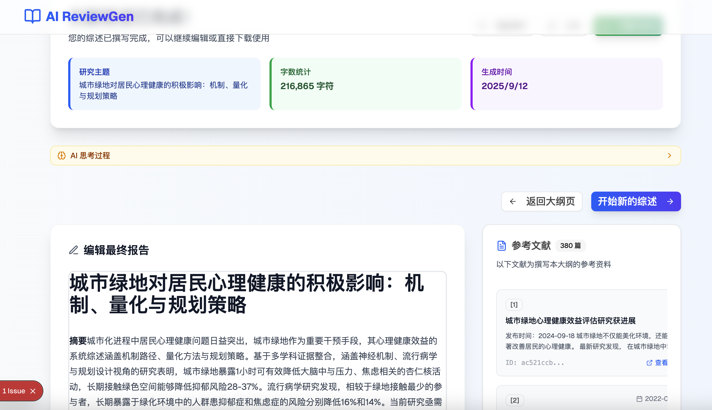
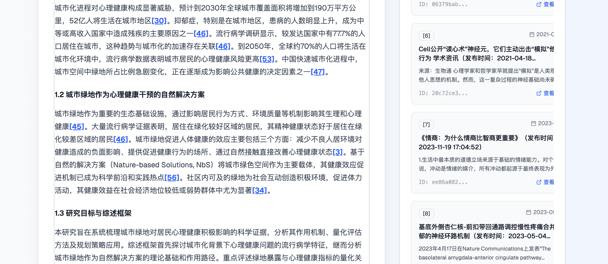
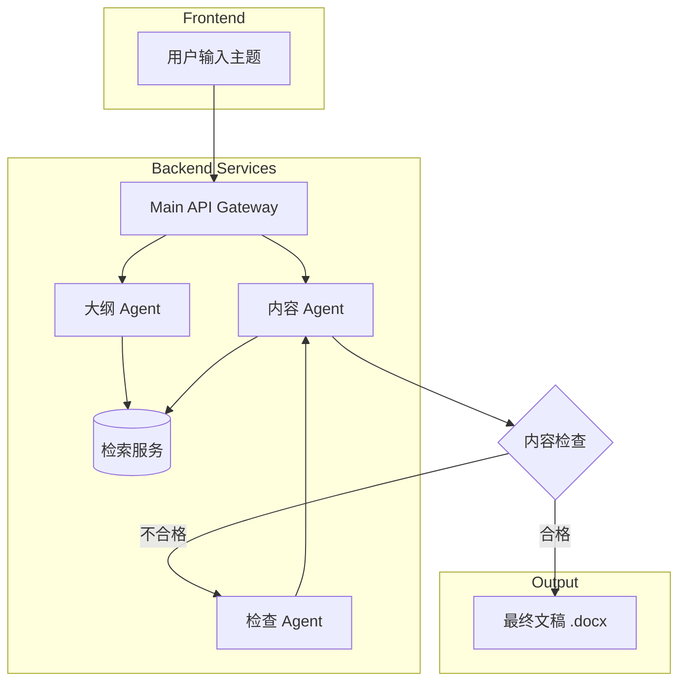

# WriterAgent - 智能论文综述写作助手

[](https://opensource.org/licenses/MIT)
类似Openai的DeepResearch，还以写教案，写基金，写报告，只需开发自己的搜索引擎即可。
WriterAgent 是一个基于大语言模型的智能论文综述写作智能体，旨在通过一个直观的 Web 界面，引导用户高效完成从主题确定、大纲生成到内容撰写和二次编辑的全过程。

---
*撰写的示例文章: [城市绿地对居民心理健康的积极影响：机制、量化与规划策略.docx](doc/%E5%9F%8E%E5%B8%82%E7%BB%BF%E5%9C%B0%E5%AF%B9%E5%B1%85%E6%B0%91%E5%BF%83%E7%90%86%E5%81%A5%E5%BA%B7%E7%9A%84%E7%A7%AF%E6%9E%81%E5%BD%B1%E5%93%8D%EF%BC%9A%E6%9C%BA%E5%88%B6%E3%80%81%E9%87%8F%E5%8C%96%E4%B8%8E%E8%A7%84%E5%88%92%E7%AD%96%E7%95%A5.docx)*

## ✨ 效果一览

<table>
  <tr>
    <td align="center"><strong>主页</strong></td>
    <td align="center"><strong>大纲生成</strong></td>
  </tr>
  <tr>
    <td></td>
    <td></td>
  </tr>
  <tr>
    <td align="center"><strong>内容撰写</strong></td>
    <td align="center"><strong>内容编辑</strong></td>
  </tr>
  <tr>
    <td></td>
    <td></td>
  </tr>
</table>

## 核心功能

- **智能大纲生成:** 根据输入的主题，智能生成结构化、逻辑清晰的综述大纲。
- **自动化内容撰写:** 基于确认后的大纲，多智能体协作完成各章节内容的详细撰写。
- **内容二次编辑:** 在生成内容后，可通过右键菜单调用模型进行局部内容的修改和润色。
- **一键导出:** 支持将最终完成的综述内容导出为 `.docx` 文件。

## 🏗️ 系统架构

本项目采用前后端分离的微服务架构，由多个独立的智能体（Agent）协作完成复杂的写作任务。



### 项目结构

```
WriterAgent/
├── backend/            # 后端服务
│   ├── main_api/       # API 网关
│   ├── main_outline/   # 大纲生成 Agent
│   ├── main_content/   # 内容生成 Agent
│   └── search_api/     # 统一搜索服务
│   └── mock_api/       # 直接模拟体验，代替上面的4个API，只启动这个和前端即可模拟
├── frontend_nextjs/    # 前端应用 (Next.js)
├── train/              # AI 模型训练脚本
├── doc/                # 文档和项目图片
└── docker-compose.yml  # Docker 编排文件
```

## 🚀 TODO
- [ ] 添加右键编辑的Agent
- [ ] 整理训练代码
- [ ] 前端兼容适配Meraid流程图

## 🛠️ 技术栈

- **前端:** Next.js, React, TypeScript, Tailwind CSS
- **后端:** Python, FastAPI
- **AI/LLM:** Google Gemini, LangGraph, Agent Development Kit (ADK)
- **部署:** Docker, Docker Compose

## 🚀 快速入门 (Docker)

推荐使用 Docker 进行一键部署，这是最简单快捷的方式。

### 1. 环境准备

- [Docker](https://www.docker.com/get-started) 和 [Docker Compose](https://docs.docker.com/compose/install/)
- [Git](https://git-scm.com/)

### 2. 克隆项目

```bash
git clone https://github.com/johnson7788/WriterAgent
cd WriterAgent
```

### 3. 配置环境变量
[custom_model.md](../../TrainPPTAgent/doc/custom_model.md)
在启动服务前，您需要配置必要的 API 密钥。

1.  项目中 `backend/` 下的每个服务目录（`main_api`, `main_outline`, `main_content`, `search_api`）都包含一个 `env_template` 文件。
2.  您需要为 **每一个** 服务复制一份 `.env` 文件，并填入您的 API 密钥。

    **示例 (在项目根目录执行):**
    ```bash
    # 为 main_api 创建 .env 文件
    cp backend/main_api/env_template backend/main_api/.env

    # 为 main_outline 创建 .env 文件
    cp backend/main_outline/env_template backend/main_outline/.env
    
    # ...为其他后端服务重复此操作
    ```
3.  **编辑 `.env` 文件**，例如 `backend/main_api/.env`，并填入 `对应的API`。

### 4. 启动服务
完成上述配置后，执行以下命令来构建并启动所有服务：

```bash
普通启动
cd backend
python start_backend.py

# 或者docker启动
docker-compose up --build -d
```

### 5. 访问应用

服务启动成功后，打开浏览器并访问 `http://localhost:3000`。

## 👨‍💻 本地开发 (手动)

如果您希望对代码进行修改和调试，可以采用手动方式分别启动前后端服务。

### 1. 环境准备

- **Python:** 3.11+
- **Node.js:** 18.x+
- **Git**

### 2. 后端设置
```bash
# 1. 安装所有后端服务的依赖
# (建议在独立的虚拟环境中操作)
pip install -r backend/requirements.txt

# 2. 配置环境变量
# 参照 "快速入门"部分的第 3 步，为每个后端服务创建并配置 .env 文件。

# 3. 依次启动各个后端服务
# 每个服务都需要一个独立的终端窗口

# 启动 Main API (端口 7800)
python backend/main_api/main.py

# 启动 Outline Agent (端口 10050)
python backend/main_outline/main_api.py

# 启动 Content Agent (端口 10051)
python backend/main_content/main_api.py

# 启动 Search API (端口 10052)
python backend/search_api/main.py
```

### 3. 前端设置

```bash
# 1. 进入前端目录并安装依赖
cd frontend_nextjs
npm install

# 2. 启动前端开发服务器
npm run dev
```

### 4. 访问应用

打开浏览器并访问 `http://localhost:3000`。

## 🤝 贡献

欢迎各种形式的贡献！如果您有任何想法或建议，请随时提交 Pull Request 或创建 Issue。

## 📄 许可证

完全FREE

## 📫 联系我

如果您在使用中遇到问题或有任何疑问，欢迎通过以下方式联系我：


