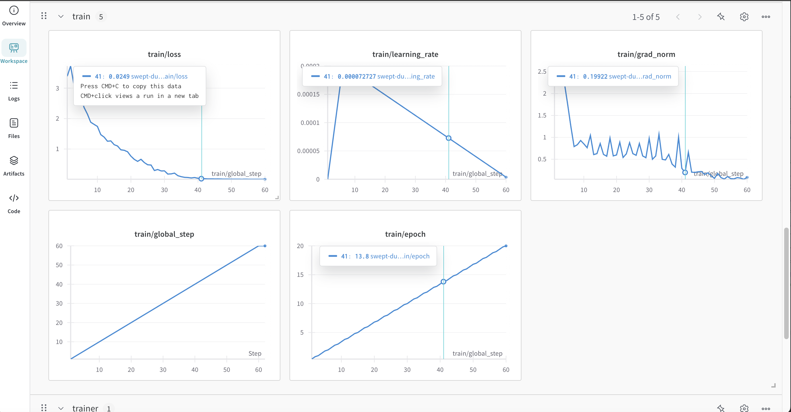

# 环境准备
llama factory 容器的的trl==0.9.6
安装：docs/llamafactory/README.md
pip install -r requirements.txt

# 测试GRPO环境，即trl和transformers是否正常安装
python GRPO_test.py

# 核心依赖，SFT和thinking模型的训练代码
[unsloth_core.py](unsloth_core.py)

# SFT代码
[train_sft.py](train_sft.py)   # 数据处理并调用unsloth_core.py进行训练
## SFT训练

1) 使用mlabonne/FineTome-100k进行训练
python train_sft.py
2) 使用自定义数据集进行训练
python train_sft.py --data_files xiaosen_sft.jsonl
使用的模型是： unsloth/Qwen3-4B-Instruct-2507

## SFT训练后的模型测试
1) 测试mlabonne/FineTome-100k数据集
python inference_sft.py
2)测试自定义数据集
```bash
python inference_sft.py \
  --ckpt_dir ./outputs/qwen3_4b_sft_lora \
  --prompt "简短介绍一下你自己。" --system "你是小森智能体（XiaoSen Health Agent）"
```

# Thinking模型训练
[train_thinking.py](train_thinking.py)   # 数据处理并调用unsloth_core.py进行训练
## Thinking模型训练
python train_thinking.py
使用的模型是： unsloth/Qwen3-4B-Thinking-2507

## 自定义训练数据集
1. 单文件（全部当作 `train`）

```bash
python train_thinking.py \
  --model_name unsloth/Qwen3-4B-Thinking-2507 \
  --chat_template qwen3-thinking \
  --data_files xiaosen_thinking.jsonl \
  --dataset_split train
```
wandb训练记录


2. 明确训练/验证拆分

```bash
python train_thinking.py \
  --data_files "train=data/train.jsonl,validation=data/val.jsonl" \
  --dataset_split train
```

3. 多分片通配

```bash
python train_thinking.py \
  --data_files "train=data/train-*.jsonl" \
  --dataset_split train
```

## Thinking模型训练后的模型测试
1）默认数据集的测试
python inference_thinking.py
2）训练xiaosen_thinking.jsonl之后的测试
python inference_thinking.py \
  --ckpt_dir ./outputs/qwen3_4b_thinking_lora \
  --system "小森智能体：用药合规与风险提示。清风丸为大健康公司新品。" \
  --prompt "请介绍下清风丸" 


# GRPO强化学习训练， 需要安装vllm
[train_grpo.py](train_grpo.py)
## GRPO模型训练
python train_grpo.py
使用的模型是： unsloth/Qwen3-4B-Base

## 显卡1上启动vllm
CUDA_VISIBLE_DEVICES=1 \
trl vllm-serve --model unsloth/Qwen3-4B-Base \
  --tensor-parallel-size 1 \
  --data-parallel-size 1 \
  --gpu-memory-utilization 0.6 \
  --max-model-len 2048 \
  --host 127.0.0.1 --port 8000

## 显卡2上训练
1）默认参数
CUDA_VISIBLE_DEVICES=2 python train_grpo.py
2）指定参数训练
CUDA_VISIBLE_DEVICES=2 python train_grpo.py \
  --model-name unsloth/Qwen3-4B-Base \
  --max-seq-len 4096 \
  --lora-rank 64 \
  --hf-dataset open-r1/DAPO-Math-17k-Processed \
  --hf-config en \
  --hf-split train \
  --output-dir outputs_qwen3_64r \
  --lora-save-dir outputs_qwen3_64r/grpo_lora \
  --max-steps 20 \
  --batch-size 2 \
  --grad-accum 8 \
  --num-generations 4 \
  --learning-rate 5e-6 \
  --weight-decay 0.01 \
  --warmup-ratio 0.1 \
  --use-vllm true \
  --vllm-server-base-url http://127.0.0.1:8000

3）自定义数据集进行训练, 医疗分诊，用药数据集
CUDA_VISIBLE_DEVICES=2 python train_grpo.py \
  --model-name unsloth/Qwen3-4B-Base \
  --hf-dataset json \
  --hf-config none \
  --hf-split train \
  --data-files xiaosen_grpo.jsonl \
  --max-seq-len 2048 \
  --lora-rank 32 \
  --max-steps 50 \
  --batch-size 1 \
  --grad-accum 1 \
  --num-generations 4 \
  --learning-rate 5e-6 \
  --logging-steps 1 \
  --output-dir outputs_grpo_custom \
  --wandb true --wandb-project grpo-dapo-math --wandb-mode online


## 模型测试
1）默认数据集进行测试
python inference_grpo.py --ckpt_dir outputs_qwen3_64r/grpo_lora --prompt "一道经典鸡兔同笼题：鸡和兔共有 20 个头，50 条腿，各有多少只？"

2）自定义数据集进行测试
python inference_grpo.py --ckpt_dir outputs_grpo_custom/grpo_saved_lora --prompt "【分诊题】47岁女性，呼吸困难加重，唇紫绀，SpO2 82%。选项：[1] 立即复苏（氧疗与通气支持） [2] 紧急评估 [3] 常规优先级 [4] 观察区 [5] 居家。"

## 对比SFT和Thinking
两段代码的“骨架”几乎一样（Unsloth + LoRA + TRL 的 SFT），但**训练目标、数据与模板**完全不同，导致学到的能力、输出风格和部署注意点都不一样。一句话：
**上面是通用指令跟随 SFT；下面是链式思维（CoT）/推理风格 SFT。**

# 关键差异一览

| 维度    | unslot\_instruct.py                                           | unsloth\_thinking.py                                       | 影响/后果                                         |
| ----- | ------------------------------------------------------------- | ---------------------------------------------------------- | --------------------------------------------- |
| 基座模型  | `unsloth/Qwen3-4B-Instruct-2507`                              | `unsloth/Qwen3-4B-Thinking-2507`                           | Instruct 侧重干净回答；Thinking 侧重显式推理/草稿思维。         |
| 聊天模板  | `qwen3-instruct`                                              | `qwen3-thinking`                                           | 模板决定特殊标记与格式；Thinking 模板会期望/容纳“思维段 + 最终答案”的格式。 |
| 数据集   | `mlabonne/FineTome-100k`（通用指令数据，先 `standardize_data_formats`） | `unsloth/OpenMathReasoning-mini` 的 `cot` 切分（数学题 + 生成解）     | 前者学“指令跟随/泛知识问答”，后者学“推理链路与解题步骤”。               |
| 数据预处理 | 用 `standardize_data_formats` 直接把开源指令数据统一成 `conversations`     | 自己把 `problem/ generated_solution` 组装成两轮对话（user→assistant）  | Thinking 明确把“解题过程”放进 assistant 回复里。           |
| 文本展开  | `apply_chat_template(..., chat_template="qwen3-instruct")`    | `apply_chat_template(..., chat_template="qwen3-thinking")` | 渲染出的 token 序列不同；Thinking 会包含“思维”段落的特殊模式。      |
| 训练目标  | “只训回答”：`train_on_responses_only`，mask 掉 user 部分               | 同样“只训回答”，但**回答里包含推理过程**                                    | Thinking 会把“思维 + 答案”一起当作可学习目标；输出更长、loss 分布不同。 |
| 任务性质  | 指令跟随/通用对话                                                     | CoT 推理（主要是数学/逻辑）                                           | Thinking 更依赖长上下文与更长的输出序列。                     |
| 监控打印  | 打印标准化后的样本与文本                                                  | 还额外 decode 了 `labels`（展示 mask 后仅保留答案部分）                    | 验证遮蔽是否符合预期。                                   |
| 其它超参  | LoRA r/alpha、优化器、LR、steps 等几乎相同                               | 同左                                                         | 超参相同，但 Thinking 的有效序列更长→显存与步时可能偏大。            |

# 实操层面的影响/注意点

1. **输出风格**

   * Instruct 模型学到的是“直接给最终回答”的格式；
   * Thinking 模型会倾向于先给出“思考/草稿段”（由模板控制其是否可见）再给“最终结论”。如果你用 `qwen3-thinking` 模板推理，通常会自动按“思维→答案”的模式渲染。

2. **数据与损失**

   * Instruct：答案通常较短、面向通用任务，loss 更集中在简明回答上。
   * Thinking：答案中包含长推理链，label 更长 → **训练更吃显存/时间**，同样步数下对“推理格式/严谨性”的拟合更强。

3. **mask 策略**（你两段代码都用 `train_on_responses_only`）

   * 当前设置会**保留整个 assistant 段为可学习**。在 Thinking 流程里，这意味着**思维链 + 最终答案都被训练**。
   * 如果你的目标是**只训“最终答案”而不训“思维链”**，需要在 `formatting_prompts_func` 阶段把“思维部分”从文本中剔除，或在 `train_on_responses_only` 的 `instruction_part/response_part` 中针对 Thinking 模板的“思维标记”做更细的遮蔽（把思维标记也当作 instruction 部分去 mask）。

4. **推理时的可见性**

   * Thinking 模型在某些模板/推理参数下可以“隐藏思维，只显示答案”，也可以“显示思维”。确保**推理端与训练端的模板一致**；想隐藏思维，就用对应模板的“隐藏思维”渲染方式/参数（与数据侧保持一致）。

5. **评测与用例**

   * Instruct：更适合问答、客服、通用助手。
   * Thinking：更适合数学、逻辑、代码推理等需要中间步骤的场景。

# 代码层面具体差异（要点摘录）

* **模型与模板**

  ```python
  # instruct
  model_name="unsloth/Qwen3-4B-Instruct-2507"
  get_chat_template(..., chat_template="qwen3-instruct")

  # thinking
  model_name="unsloth/Qwen3-4B-Thinking-2507"
  get_chat_template(..., chat_template="qwen3-thinking")
  ```

* **数据构造**

  ```python
  # instruct：通用指令数据，统一格式
  dataset = load_dataset("mlabonne/FineTome-100k", split="train")
  dataset = standardize_data_formats(dataset)
  dataset = dataset.map(formatting_prompts_func, batched=True)

  # thinking：数学推理 CoT
  dataset = load_dataset("unsloth/OpenMathReasoning-mini", split="cot")
  dataset = dataset.map(generate_conversation, batched=True)
  dataset = dataset.map(formatting_prompts_func, batched=True)
  ```

* **调试输出**

  ```python
  # instruct
  print(dataset[100]); print(dataset[100]['text'])

  # thinking：额外演示 labels 仅保留回答（含思维+答案）
  tokenizer.decode(trainer.train_dataset[100]["input_ids"])
  tokenizer.decode([tokenizer.pad_token_id if x == -100 else x
                    for x in trainer.train_dataset[100]["labels"]]).replace(tokenizer.pad_token, " ")
  ```

# 什么时候选哪个？

* 你要一个**稳妥简洁**的通用助手：选 **Instruct** 训练方案。
* 你要**显式推理能力/步骤**（数学、逻辑、代码）：选 **Thinking** 训练方案（并使用带 CoT 的数据与 `qwen3-thinking` 模板）。

# 小建议

* **一致性**：训练用什么模板，就用什么模板推理；否则标记对不上，输出会奇怪。
* **显存与步长**：Thinking 的样本更长，必要时减小 `per_device_train_batch_size` 或增加 `gradient_accumulation_steps`，并留意 `max_seq_length`。
* **只训答案**：若你不想让模型学会“吐思维过程”，在数据阶段剥离思维段，或在遮蔽规则上单独屏蔽“思维标记”到最终答案之间的内容。


